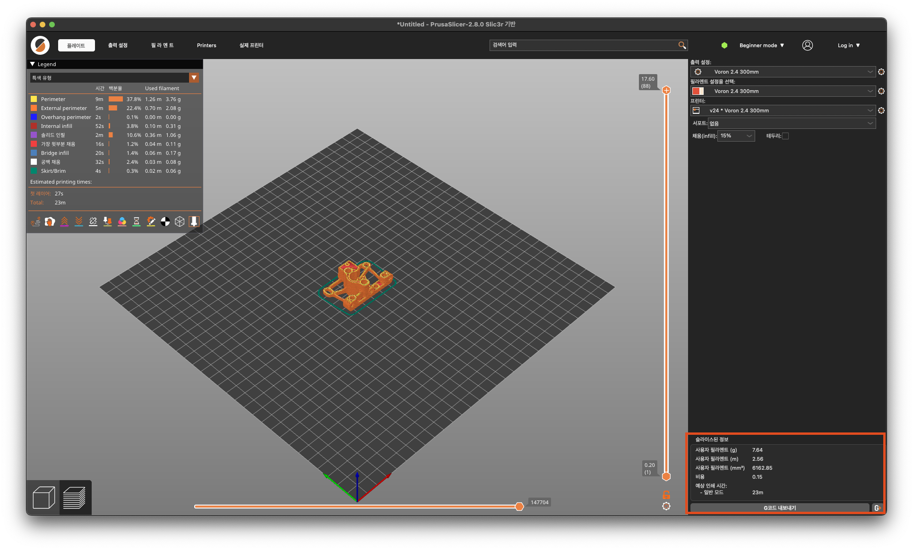

# CHIRO_3DPrinter_GUIDE
이 repo는 중앙대학교 통일공대 로봇 동아리 CHIRO를 위한 3D 프린터 사용 가이드 및 정비 가이드 관련 문서입니다.

# [동아리 프린터](https://github.com/2lectro-racoon/CHIRO_3DPrinter/tree/main/Printers)

동아리방에 보유중인 프린터 리스트입니다.

총 3대의 프린터를 운용중에 있으며 종류는 아래와 같습니다.

Voron 2.4

Sapphire Plus v3 trident

ender3

해당 프린터의 사진은 위 소제목을 클릭하면 확인하실 수 있습니다.

# [예약 구글 스프레드 시트](https://docs.google.com/spreadsheets/d/1wqA8Xc8Nbucf8mbVy7zQWF-za3Rr88YbO-wAvKrq4g4/edit?usp=sharing)

### 꼭 위 시트에서 예약하시고 사용해주세요. 시트에 적혀있지 않는 경우, 취소시킬 수 있습니다.

### 소요시간은 슬라이서에서 나오는 시간보다 한시간정도 여유롭게 작성해주세요.

### 필라멘트 사용량또한 기록 해주세요.

우측 하단에 보면 소요시간, 필라멘트 사용량이 계산되어 나옵니다.

이 내용을 링크에 있는 스프레드 시트에 작성해주시면 되는데, 프린터를 맞게 선택하였는지 확인하시고 작성해주세요.

작성되어있지 않는 상태로 출력중인 경우, 취소될 가능성이 있습니다.

(https://docs.google.com/spreadsheets/d/1wqA8Xc8Nbucf8mbVy7zQWF-za3Rr88YbO-wAvKrq4g4/edit?usp=sharing)

# [동아리 Prusa Slicer 사용법](https://github.com/2lectro-racoon/CHIRO_3DPrinter/tree/main/PrusaSlicer)
슬라이서는 프루사슬라이서를 선택하였습니다.

위의 제목을 클릭하면 프루사슬라이서 초기 설정법 화면으로 이동합니다.

# [필라멘트 교체방법](https://github.com/2lectro-racoon/CHIRO_3DPrinter/tree/main/Maintenance_Guide/Filament_Change)
필라멘트 교체 방법입니다.

작성예정입니다.